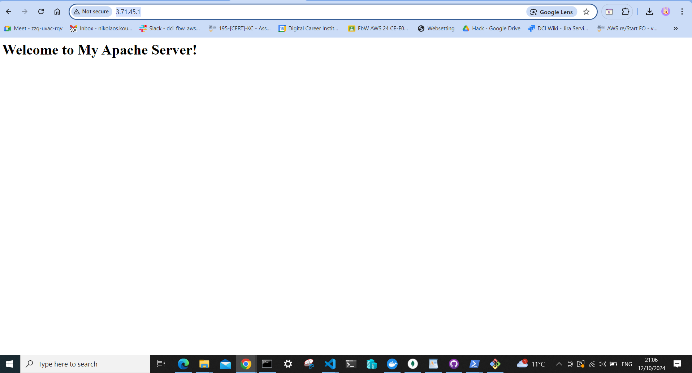

# Simple Static Website on Apache Server

A simple static website hosted on an Apache server running on AWS EC2. This project demonstrates how to set up and serve a static HTML page using Apache.

## Introduction
This project showcases a simple static website that provides a welcoming message to visitors. It utilizes Apache web server hosted on Amazon EC2, illustrating basic web hosting concepts and cloud computing practices.

## Features
- Lightweight static website.
- Easy to deploy and configure using AWS services.
- Accessible globally via the public IP of the EC2 instance.
- Simple and clean HTML structure.

## Technologies Used
- **AWS EC2**: Utilized for hosting the Apache server.
- **Apache**: Serves the static HTML files.
- **HTML**: Basic structure of the website.

## Installation
1. Clone the repository:
    ```bash
    git clone https://github.com/your-username/apache-project.git
    ```
2. Follow the AWS EC2 setup instructions in the project documentation to launch your instance and install Apache.

## Usage
- Access the website via your EC2 instance's public IP:
    ```bash
    http://3.71.45.1
    ```

## Configuration
- Ensure your EC2 instance has the correct security group settings to allow HTTP traffic on port 80.

## Demonstration
  
*Screenshot of the website in a web browser.*

## Contributing
Contributions are welcome! Please submit a pull request with your proposed changes.

## License
This project is licensed under the MIT License - see the [LICENSE](LICENSE) file for details.

## Acknowledgments
- Inspired by tutorials on AWS EC2 and Apache setup.
- Special thanks to the open-source community for their resources. 
